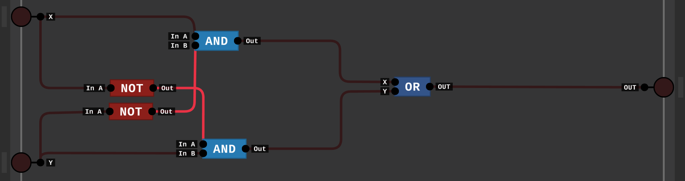
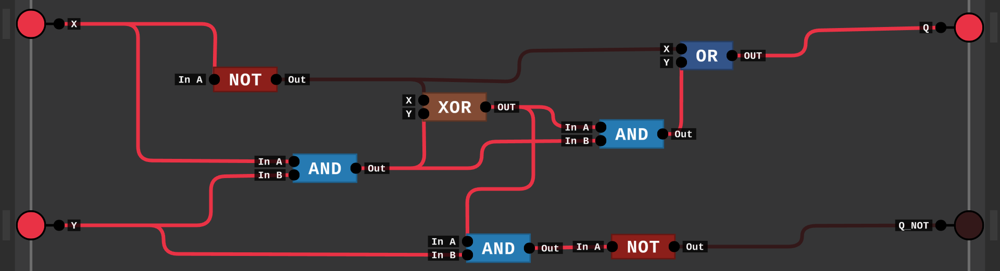

# LogicLang

The inbuilt functions: `NOT`, `AND` and `TTY`<br>
The inbuilt functions will be **not** be case sensitive<br>
The user defined gates will be case sensitive

**LogicLang** is a circuit based functional language which only works on binary logic gates.

## Examples

**LogicLang** uses an ASCII version of `TTY` protocol to use the standard output

> TTY : Teletypewriter

```
circuit main {
  TTY(expand_to_bin!(32),expand_to_bin!(32),0,1,0,0,1,0,0,0);
  TTY(expand_to_bin!(33),expand_to_bin!(32),0,1,1,0,1,0,0,1);
}
```

This is "HI" at x position `32` and y position `32` in **LogicLang**<br>
But you won't need to print a lot in **LogicLang**, it is designed to logic gates primarily

Here is a `OR` gate in **LogicLang**

```
circuit OR {
  in x, y;
  out NOT(AND(
    NOT(x),
    NOT(y)
  ));
}
```

And we can reuse those circuits

```
circuit NOR {
  in x, y;
  out NOT(OR(x, y));
}
```

You can also chain logic gates


```
circuit XOR {
  in X,Y;
  out OR(
    AND(
      X,
      NOT(Y)
    ),
    AND(
      NOT(X),
      Y
    )
  );
}
```

You can also reuse outputs from circuits


```
circuit weird {
  in X, Y;

  out connect notX NOT(X) to
  connect andXY AND(X, Y) to
  connect xorOutput XOR(andXY, notX) to
  OR(
    notX,
    AND(xorOutput, andXY)
  ),
  NOT(AND(
    xorOutput,
    Y
  ));
}
```

Here we are taking the circuit above and referencing each output pin in `main`

The `main` circuit is where the program starts running

```
circuit main {
  in X, Y;

  out connect weirdOut weird(0, 1) to
  AND(weirdOut.0, weirdOut.1)
}
```

Here is the final circuit

```
circuit OR {
  in x, y;
  out NOT(AND(
    NOT(x),
    NOT(y)
  ));
}
circuit XOR {
  in X,Y;
  out OR(
    AND(
      X,
      NOT(Y)
    ),
    AND(
      NOT(X),
      Y
    )
  );
}
circuit weird {
  in X, Y;

  out connect notX NOT(X) to
  connect andXY AND(X, Y) to
  connect xorOutput XOR(andXY, notX) to
  OR(
    notX,
    AND(xorOutput, andXY)
  ),
  NOT(AND(
    xorOutput,
    Y
  ));
}
circuit main {
  in X, Y;

  out connect weirdOut weird(0, 1) to
  AND(weirdOut.0, weirdOut.1)
}
```

# HOW TO BUILD/USE:
## On Windows
You will need [GNU Make](https://www.gnu.org/software/make/) installed as well as [GCC](https://www.mingw-w64.org/).<br>
To build the project run the command `make windows`
## On Linux
You will need `make` installed.<br>
To build run `make linux`<br>

### On debian based linux
Install `make` with `sudo apt install make`
### On Arch 
Install `make` with `sudo yarn install make`


